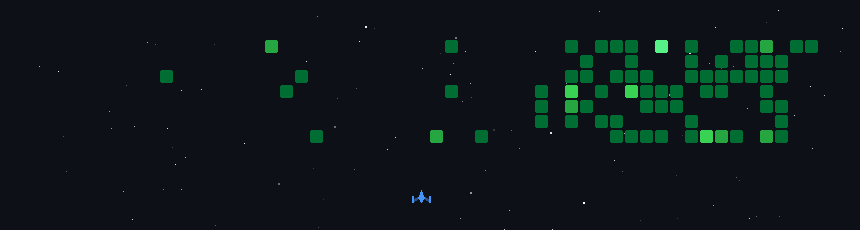

 
# Hi, I'm Shàven 👋
- I'm a sixth form student at Lawrence Sheriff School who makes weird and wonderful programs in my spare time. Still mad about Atom being discontinued
<h2>I am Currently: </h2>
<ul>
 <li>Building Darevault for Flavourtown</li>
  <li>Studying for A levels</li>
  <li>Learning Godot for Campfire</li>
</ul>
<h2>Technologies I use</h2>
 <li>Web Development:</li>
 
  
  
  <li>Design and Illustration:</li>
  
   
  
  <li>Game Development</li>
  
  
  
</ul>

 

 

