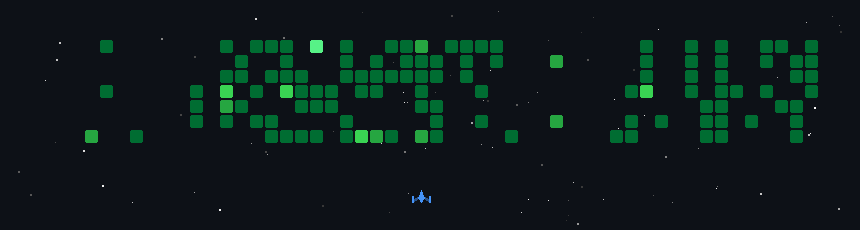

---

# Hi, I'm Shàven 👋

- I'm a student developer who works throughout multiple domains such as web, game and mobile development.
-  I've built full stack systems from the ground up using Vue and Firebase, made games with Unity and Godot and started learning multiplatform development with Flutter.
-   I am also proficient in vector illustration with Inkscape and video editing with Premiere Pro.
-   Alongside these, I enjoy tinkering with low level languages and hardware, guiding students into tech and contributing to open-source projects.

<h2>I am Currently: </h2>
<ul>
 <li>Building Darevault for Flavourtown</li>
  <li>Studying for A levels</li>
  <li>Learning Godot for Campfire</li>
</ul>
<h2>Technologies I use</h2>
 <li>Web Development:</li>
 
  
  
  <li>Design and Illustration:</li>
  
   
  
  <li>Game Development</li>
  
  
  
</ul>

 

 

